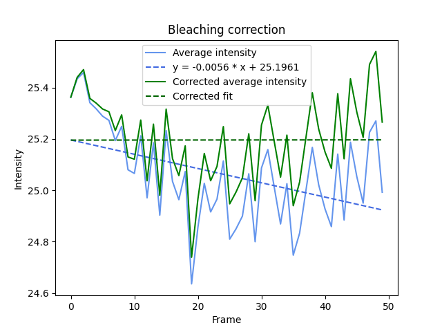

# Bleach correction
When bleach correction is turned on, the algorithm will fit a linear equation to the average intensity over time. Using this equation, it will correct the signal to maintain a more constant intensity level. 
 
Every outputfolder will contain such a graph that displays the bleach correction.