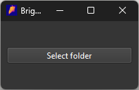
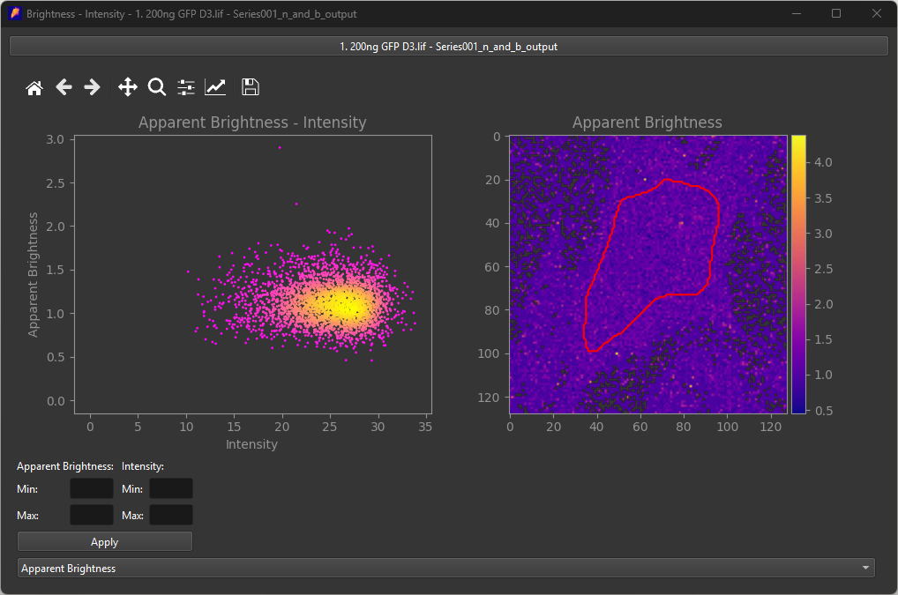
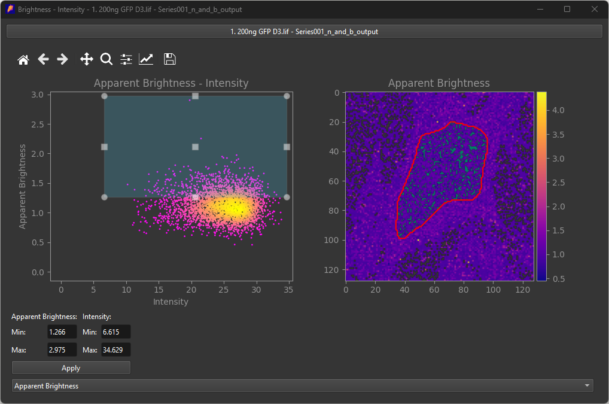
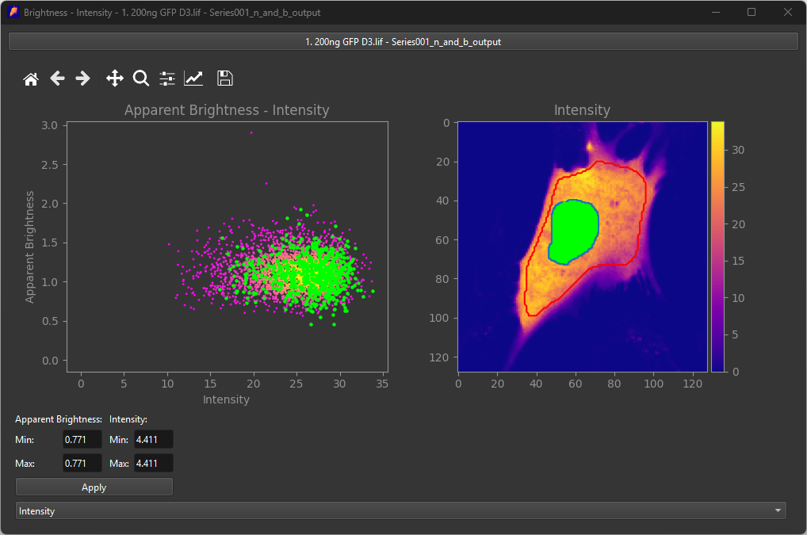

# Interactive data inspection
The application contains tools to interactively inpect the data to see which regions in the cell belong to certain brightness/intensity values, and the other way around.

In the menu bar, navigate to *Tools>Brightness - Intensity*.

Then press **Select folder** and open the desired outputfolder generated a previous analysis, a new window should open:

This window shows the apparent brightness in the ROI against the average intensity on a scatter plot, along with the ROI overlayed on the apparant brightness and intensity images.
In the scatter plot, it is possible to select a rectangle to inspect which pixels on the image belong to which dot on the plot.

On the images, it is possible to select a specific region using a lasso selector to inspect where certain pixels are located inside the scatter plot.

