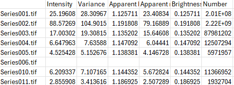

# Output
For every processed image, the application generates an output folder containing to following files:
- apparent_brightness.npy
    - File containing the apparant brightness values for the entire image. Npy files can be easily loaded into python.
- apparent_number.npy
    - File containing the apparant number values for the entire image. Npy files can be easily loaded into python.
- brightness.npy
    - File containing the brightness values for the entire image. Npy files can be easily loaded into python.
- number.npy
    - File containing the number values for the entire image. Npy files can be easily loaded into python.
- intensity.npy
    - File containing the intensity values for the entire image. Npy files can be easily loaded into python.
- variance.npy
    - File containing the variance values for the entire image. Npy files can be easily loaded into python.
- apparent_brightness.tif
    - File containing the apparant brightness values for the entire image.
- apparent_number.tif
    - File containing the apparant number values for the entire image.
- brightness.tif
    - File containing the brightness values for the entire image.
- number.tif
    - File containing the number values for the entire image.
- intensity.tif
    - File containing the intensity values for the entire image.
- variance.tif
    - File containing the variance values for the entire image.
- apparent_brightness.png
    - File containing a preview of the apparant brightness values for the entire image.
- apparent_number.png
    - File containing a preview of the apparant number values for the entire image.
- brightness.png
    - File containing a preview of the brightness values for the entire image.
- number.png
    - File containing a preview of the number values for the entire image.
- intensity.png
    - File containing a preview of the intensity values for the entire image.
- variance.png
    - File containing a preview of the variance values for the entire image.
- cellmask.png
    - Figure showing the segmentation used for the analysis
- eroded_mask.png
    - Figure showing the eroded mask.
- segmentation_image.tif
    - The image used for the segmentation model. The mean projection of all timepoints.
- segmentation_image_seg.npy
    - Raw results of the segmentation by cellpose.
- Bleach_correction.png
    - Results of the bleach correction
- brightness_x_intensity.png
    - Scatter plot showing apparent brightness vs intensity.
- brightness_intensity_values.csv
    - Csv file containing the values used for the scatter plot (apparent brightness and intensity values inside the ROI).
- average_values_in_roi.csv
    - The average apparent brightness, apparent number, brightness, number, intensity and variance values in the ROI.

**Batch processing** 
When batchprocessing is turned on, an extra csv file is generated in the parent folder, containing the output values from multiple experiments:

- Folder_average_values_in_roi.csv

