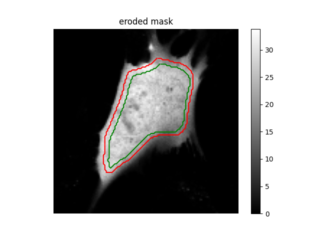
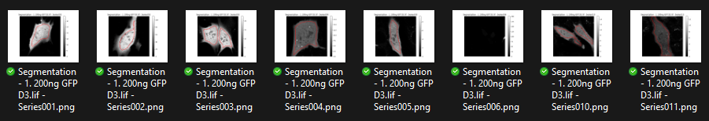

# Parameters
Numbers and brightness contains several parameters that affect the analysis pipeline.

#### Background
The background value used for the numbers and brightness calculations. For more information, see [calculations](calculations.html)

#### Segment
Turn on automatic segmentation using [cellpose 3](https://github.com/MouseLand/cellpose)

#### Cellpose settings
Settings passed to the cellpose model. For more information, see the [cellpose documentation](https://cellpose.readthedocs.io/en/v3.1.1.1/)

#### Analysis
Automatically calculate average numbers and brightness values inside the cell (using cellpose segmentation). Will create a .csv file inside each outputfolder. When using batch processing, will create an additional .csv file in the parent folder containing results from all .tif files in the folder.

##### Erode
Remove a certain number of pixels from the edge of the segmentation. Intended to exclude edge artefacts caused by cell movement from the final results.

#### Bleach correction
Perform simple bleach correction using linear fitting. For more information, see [bleach correction](bleach_correction.html).

#### Use existing segmentation
Use existing segmentation. The algorithm will look for existing segmentations in the existing outputfolder. If not present, will perform cellpose segmentation instead. Can be used to manually insert/correct segmentations. For more information, see [segmentation correction](segmentation_correction.html).

#### Create overview
Create overview folders containing segmentation and brightness results. Can be used to get a quick look at the analysis results of a batch.

