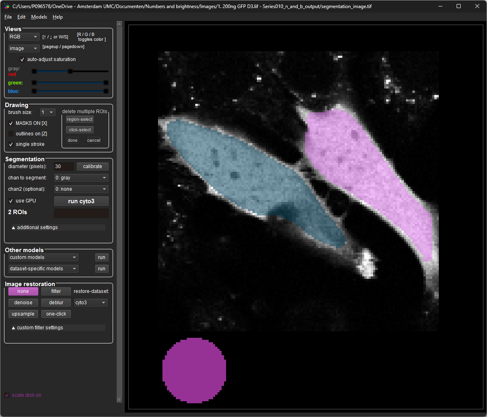
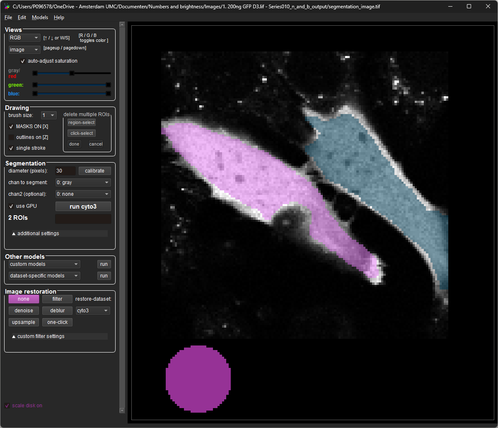

# Segmentation correction
The segmentation might not always be 100% accurate. The application contains functionality to manually correct segmentations.

First, in the main window menubar, selects *tools>cellpose*. The application will start the cellpose GUI. This might take a few seconds. 

In cellpose, select *File>Load Image* and navigate to the outputfolder of the image you want to correct. Then open the file called *segmentation_image.tif*. Cellpose should automatically load the existing segmentation. 

In cellpose, you can use Ctrl+LMB (Left Mouse Button) on a cell to remove the segmentation. A new segmentation can be created by pressing RMB (Right Mouse Button) once and drawing a new ROI.

Cellpose should automatically save these segmentations, the can be validated using the command prompt. If this is not happening, you can manually save the file using *File>Save masks and image (as \*_seg.npy)*

Now it is possible to process the image again, but this time turning on the parameter **Use existing segmentation**. The application will now use the corrected segmentation. 
Running the analysis without this parameter, and **Segment** turned on will override the custom segmentation.

Lastly, the cellpose GUI is a nice place to play around with the cellpose parameters cuch as **flow_threshold**, **cellprob_threshold** and **diameter** to see how they affect the segmentation.