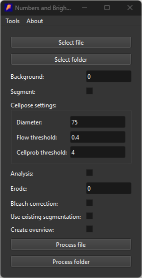

# Usage
The application expects simple .tif files with shape (t, y, x). File i/o is performed using [tifffile](https://github.com/cgohlke/tifffile). 
In the main menu it is possible to select either a single tif file, or an entire folder of tif files.

The application contains several parameters, a brief description can be found [here](parameters.html).
Progress can by tracked inside the command prompt.
When using cellpose segmentation, the first iteration might take a bit longer, as the application will be loading in the cellpose package and model. Once loaded, both are cached and will not have to be reloaded again. 
When selecting either **Analysis** or **Bleach correction**, segmentation must be turned on, as these both need to know which pixels belong to the cell.